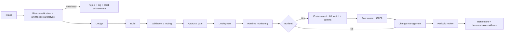

# Enterprise AI Governance and Control Framework for Scaled Corporate Adoption

## Executive synthesis

**Part I — Executive synthesis**

### Executive summary

**Fact:** The most authoritative “enterprise-implementable” foundation for AI governance today is a composite of (i) risk-management scaffolding (NIST AI RMF 1.0: GOVERN–MAP–MEASURE–MANAGE and the trustworthiness characteristics), (ii) an auditable management-system wrapper (ISO/IEC 42001’s AI management system approach and its Annex SL alignment with other ISO management systems), and (iii) enforceable, architecture-level control patterns drawn from major vendors’ operational artefacts (guardrails, documentation templates, threat-modelling/red-teaming playbooks, and audit logging primitives). citeturn19view0turn20view0turn28search2turn28search5turn12search7turn26view3turn26view4turn27view0

**Inference:** Enterprises fail when they treat “AI governance” as a document-centric policy layer rather than an internal control system: decision rights, control objectives, control designs, evidence artefacts, monitoring signals, and remediation loops must be built into delivery pipelines and runtime operations (not appended after deployment). This follows directly from how NIST frames AI systems as socio-technical and dynamic (risk emerges from system + context + humans) and from ISO’s management-system emphasis on continual improvement, internal audit, and corrective action. citeturn19view0turn28search2turn28search5

**Recommendation:** Use a **risk-tiered governance operating system** that (1) makes “low-risk” deployments fast via pre-approved patterns and automated evidence capture, (2) concentrates intensive assurance on “high-risk” and “agentic/action-capable” systems, and (3) is regulator-defensible under EU/UK/US scrutiny through explicit traceability from risk classification → lifecycle gate intensity → evidence packs → monitoring and incident handling. citeturn24search1turn24search11turn1search6turn1search3turn25search0

### Core thesis

**Fact:** NIST AI RMF 1.0 is explicit that the framework is intended to be “practical” and operationalised, with **GOVERN** applying across lifecycle stages and **MAP/MEASURE/MANAGE** applied in context and at specific stages. citeturn19view0

**Inference:** The adoption-accelerating move is to treat governance as an **enterprise internal control framework for an AI estate** (models + systems + dependencies), not as a model-only review committee. AI estates are increasingly composed of model services, RAG retrieval layers, prompts/instructions, tools/actions, and multi-party dependencies; governance must therefore target *system-of-systems* risk, not only model metrics. citeturn19view0turn23search1turn14search0turn27view3

**Recommendation:** Build a **single enterprise control taxonomy** with architecture-specific deltas (app-first vs chat-first vs RAG vs agentic vs decision-support vs workflow automation vs open-weight self-hosted), and wire it to **standardised lifecycle gates** and **automated evidence** so that “doing the right thing” becomes the fastest path. citeturn20view0turn12search7turn24search7

### Why enterprises fail at AI governance

**Fact:** NIST highlights that AI risks and failures can be hard to detect and respond to due to complexity and socio-technical interactions; trustworthiness can degrade as data and contexts change. citeturn19view0

**Inference:** Enterprise failures cluster into a small number of repeatable breakdown modes (MECE):

- **Mis-scoped governance:** governing “models” while ignoring retrieval, prompts, tool actions, and downstream business processes (a common root cause in indirect prompt injection and tool-misuse attack surfaces). citeturn23search1turn27view3  
- **Unwired tiering:** a risk classification that does not change gate intensity, approvals, evidence requirements, and monitoring (classification without treatment). fileciteturn0file0  
- **Compliance theatre:** documentation-heavy, control-light programmes (paper artefacts without runtime monitoring, audit logging completeness, or remediation loops). citeturn25search0turn27view0  
- **Misallocated friction:** over-governing low-risk internal copilots and under-governing high-impact customer-facing or individual-affecting systems. fileciteturn0file0  

**Recommendation:** Establish a **governance misallocation diagnostic** (where approvals and evidence work are being spent vs where harm potential exists), then re-balance: fast-lane low-risk; intensify review for high-risk decisioning and agentic actions. fileciteturn0file0

### Why bad governance slows AI adoption

**Fact:** AWS’s Responsible AI Lens is designed as lifecycle-aligned “questions + best practices” for builders, reducing ambiguity at design time. citeturn12search3turn26view2

**Inference:** Bad governance creates *queueing* (centralised committees become bottlenecks) and *ambiguity* (unclear content expectations force re-work). It also produces *shadow AI* (teams route around controls), reducing actual control. Those dynamics are predictable from first principles of throughput: if controls are not standardised, pre-approved, and automatable, they become the limiting step.

**Recommendation:** Convert governance from “approvals” to **productised governance services**: pre-approved reference architectures, standard templates, automated tests, built-in logging, and self-service tooling for low-risk classes. This preserves assurance while increasing deployment velocity. citeturn12search7turn14search0turn27view0

### Design principles for adoption-accelerating governance

**Fact:** ISO’s management-system standards use a harmonised structure (Annex SL / Harmonized Structure) to reduce duplication and support integration with other management systems. citeturn28search5

**Inference:** Adoption acceleration requires a governance design that is:
1) **Risk-tiered** (intensity proportional to harm and autonomy),  
2) **Artefact-standardised** (templates and evidence packs reduce cognitive load),  
3) **Pipeline-integrated** (evidence generation and tests are automated),  
4) **Runtime-verifiable** (monitoring signals prove ongoing control),  
5) **Exception-managed** (waivers are time-bound and measurable),  
6) **Vendor-agnostic at policy level** (portable across cloud/model providers), while being **vendor-aware at control-implementation level** (use provider tooling where it reduces burden). citeturn28search5turn12search7turn14search0turn27view0

**Recommendation:** Implement governance as an **AIMS-aligned control system**: policy ↔ controls ↔ evidence ↔ monitoring ↔ corrective action, with explicit ownership and audit trails. citeturn28search2turn25search0

## Scope and conceptual model

**Part II — Scope and conceptual model**

### Purpose and scope

**Fact:** NIST AI RMF is voluntary and intended for organisations that design, develop, deploy, or use AI systems, focusing on risk management and trustworthiness. citeturn19view0turn0search4

**Fact:** ISO/IEC 42001 specifies requirements for establishing, implementing, maintaining, and continually improving an **AI management system (AIMS)** within organisations that provide or use AI-based products or services. citeturn28search2turn28search0

**Recommendation:** This framework assumes an enterprise that:
- operates in multiple jurisdictions (EU/UK/US baseline),  
- faces audit and supervisory scrutiny,  
- intends to deploy AI aggressively across internal productivity and external products,  
- has existing security/privacy/risk governance (e.g., ISO 27001-style ISMS or equivalent), and  
- needs a reusable, control-oriented operating system rather than bespoke review per use case. citeturn28search5turn25search0turn1search13

### Definitions

**Fact:** NIST defines AI systems and frames AI risk as likelihood × magnitude of harm, emphasising socio-technical nature and lifecycle dynamics. citeturn19view0

**Fact:** ISO management system standards (Annex SL) are structured for integration and continual improvement. citeturn28search5

**Operational definitions (enterprise control meaning):**
- **Governance:** Board- and executive-directed **decision rights, accountability, and oversight** for how AI is used and controlled; includes risk appetite, policy, resourcing, and accountability mechanisms.
- **Controls:** Specific **preventive/detective/corrective mechanisms** embedded in process, technology, and people to reduce risk.
- **Risk management:** The process to identify, assess, treat, and monitor risk (AI-specific and system-level). citeturn19view0
- **Assurance:** Independent evaluation that controls are designed effectively and operating as intended (internal audit, second-line testing). citeturn25search0
- **Compliance:** Demonstrable adherence to laws/regulations/contractual obligations; evidence-based.
- **Model governance (narrow):** Controls over model selection, evaluation, versioning, and performance monitoring.
- **System governance (broad):** Controls over the **end-to-end AI system**: prompts, retrieval, tools/actions, users, outputs, integrations, and operating environment. citeturn23search1turn14search0turn27view3
- **Monitoring:** Runtime signals and thresholds detecting anomalies and policy/control violations.
- **Incident response:** Severity-based escalation, containment, remediation, and lessons-learned loops.

### Governance boundary model

**Boundary rule (MECE):** Every AI deployment has three simultaneously governed planes:

1) **Business plane:** purpose, decision impacts, affected populations, risk appetite, accountability.
2) **Technical plane:** model/system architecture, data flows, security controls, evaluation, monitoring.
3) **Operational plane:** change management, access governance, vendor oversight, incident response, audit evidence.

**Fact:** NIST explicitly separates organisation-wide GOVERN from system-context MAP/MEASURE/MANAGE. citeturn19view0

**Recommendation:** Assign owners and evidence per plane; prevent “everyone owns it” diffusion by requiring a named **System Owner** and **Business Outcome Owner** for each production AI system.

### What must be governed in an enterprise AI estate

**Fact:** The NIST GenAI Profile is explicit that GAI risks vary by lifecycle stage, source (inputs/outputs/humans), and scope (model, system, ecosystem), and it focuses on governance, content provenance, pre-deployment testing, and incident disclosure. citeturn20view0

**Governing object model (MECE asset classes):**
- **Models:** base model, fine-tunes, adapters, embeddings models, safety classifiers.
- **Systems:** applications/services exposing AI capabilities (APIs, UIs, agents, pipelines).
- **Instructions:** system prompts, tool instructions, routing rules, safety policies-as-code.
- **Retrieval:** indexes/vector stores, corpus sources, ingestion pipelines, freshness policies.
- **Tools/actions:** permitted tool catalogue, execution environments, credentials, action scopes.
- **Data:** training/finetune data, prompts/responses as data, logs, evaluation datasets.
- **Outputs:** generated content, decisions/support outputs, action confirmations, disclosures.
- **Users/roles:** human users, service accounts, agent identities, privileged roles.
- **Vendors/supply chain:** model providers, hosting providers, tool vendors, dataset suppliers.
- **Lifecycle changes:** model updates, prompt edits, retrieval corpus changes, tool changes.
- **Audit trails:** immutable logs for inputs/outputs/actions, approvals, tests, changes. citeturn19view0turn27view0turn23search1

### Enterprise AI system archetypes

**Archetypes (MECE by interaction + autonomy):**
- **App-first:** AI embedded in an application workflow (forms, back-office ops, embedded inference).
- **Chat-first:** conversational interface is primary UX; user prompts drive system behaviour.
- **Hybrid:** application flow plus conversational layer and/or embedded copilots.
- **RAG:** retrieval-augmented generation; separate retrieval plane and corpora poisoning risks. citeturn23search15turn23search3
- **Agentic (single-agent):** tool-calling loop with scoped action execution. citeturn27view3turn14search7
- **Agentic (multi-agent orchestrated):** orchestrator + specialised subagents with cross-agent trust boundaries. fileciteturn0file0
- **Workflow automation:** AI triggers/runs process steps (e.g., ticket triage, document routing) with bounded actions.
- **Decision-support:** AI provides recommendations/assessments used by humans for consequential decisions.
- **Autonomous / semi-autonomous:** bounded or unbounded autonomy with limited human review.
- **Open-weight self-hosted:** enterprise hosts model weights/inference stack; weakened vendor-side SLAs, stronger supply-chain/provenance controls required. fileciteturn0file0

## Comparative framework analysis

**Part III — Comparative framework analysis**

### NIST AI RMF

**Fact:** NIST AI RMF defines trustworthiness characteristics including valid/reliable, safe, secure/resilient, accountable/transparent, explainable/interpretable, privacy-enhanced, and fair with harmful bias managed. citeturn19view0  
**Fact:** The Core functions are GOVERN, MAP, MEASURE, MANAGE. citeturn19view0

**Enterprise value (compare, not summarise):**
- **Governance design contribution:** Strong conceptual separation between organisation-wide governance (GOVERN) and system-level work (MAP/MEASURE/MANAGE), useful for building decision rights and accountability structures.
- **Control design contribution:** Provides *what to manage* (risks, trustworthiness traits) but is intentionally non-prescriptive about *how to implement* technical controls; enterprises must map to control designs and evidence.
- **Assurance contribution:** Gives a structured lens for what auditors expect to see (policies, roles, documentation, and risk treatment), but not a control catalogue comparable to ISO Annex A.
- **Adoption impact:** Low friction initially (voluntary, flexible), but can become vague without a concrete control system and automation.

### NIST GenAI Profile

**Fact:** The NIST GenAI Profile is a cross-sectoral profile companion to AI RMF 1.0, developed to address risks unique to or exacerbated by generative AI; it organises suggested actions by AI RMF subcategories and focuses on governance, content provenance, pre-deployment testing, and incident disclosure. citeturn20view0

**Enterprise value:**
- **Governance design contribution:** Makes GenAI-specific governance *operational* via action IDs tied to RMF subcategories.
- **Control design contribution:** Adds specificity for provenance, eval/testing, and incident disclosure—areas where many enterprises under-invest.
- **Assurance contribution:** Strengthens “evidenceable” expectations (documented alignment with law, testing, provenance controls).
- **Adoption impact:** Helps avoid re-inventing GenAI controls; still needs translation into enterprise control matrices, owners, and runtime signals.

### ISO/IEC 42001

**Fact:** ISO/IEC 42001 is an AI management system standard specifying requirements for establishing, implementing, maintaining, and continually improving an AIMS. citeturn28search2turn28search7  
**Fact:** ISO management system standards share a harmonised structure (Annex SL) to support integration and coherence across standards. citeturn28search5

**Inference (because ISO full text is generally paywalled):** Public secondary analyses consistently describe ISO/IEC 42001 as using Clauses 4–10 (context, leadership, planning, support, operation, performance evaluation, improvement) and containing Annexes (including a reference control set in Annex A). Treat the exact control counts/domains as indicative unless validated against licensed text. citeturn28search2turn28search5turn28search10

**Enterprise value:**
- **Governance design contribution:** Strongest for building an auditable “management system”: leadership accountability, competence, internal audit, corrective actions—highly compatible with enterprise assurance models.
- **Control design contribution:** More control-oriented than NIST (via Annex controls guidance) but still requires tailoring to AI architectures (RAG/agentic specifics are not the standard’s primary focus).
- **Assurance contribution:** Best of the three for audit-readiness due to explicit management-system expectations (internal audits, continual improvement).
- **Adoption impact:** Higher upfront implementation burden, but lower long-run friction if integrated with existing ISO-style governance and evidence processes.

### Optional OECD layer

**Recommendation:** Omit OECD AI Principles in the control design and assurance sections because they do not materially increase operational control specificity beyond NIST RMF trustworthiness characteristics and ISO/IEC 42001’s management-system requirements in a corporate implementation context. (If you need board-level cross-border narrative alignment, include OECD only as a **single paragraph** in board reporting, not as a control source.) citeturn19view0turn28search2

### Deliverable A — enterprise comparative matrix

| Framework | Purpose | Legal status | Implementation style | Governance utility | Control utility | Assurance utility | Strengths | Limitations | Enterprise adoption value |
|---|---|---|---|---|---|---|---|---|---|
| NIST AI RMF 1.0 | Risk management for AI trustworthiness across lifecycle citeturn19view0 | Voluntary | Functional model (GOVERN–MAP–MEASURE–MANAGE), categories/subcategories citeturn19view0 | High (clarifies governance vs system work) | Medium (needs translation to controls) | Medium (needs evidence design) | Clear risk framing; socio-technical emphasis; flexible citeturn19view0 | Non-prescriptive; can become “principles-only” without control mapping | Strong base layer for multi-domain enterprise framework |
| NIST GenAI Profile | GenAI-specific risks + suggested actions mapped to RMF subcategories citeturn20view0 | Voluntary | Action tables aligned to RMF; focuses on governance, provenance, testing, incident disclosure citeturn20view0 | High | Medium–High (more actionable than RMF) | Medium–High (adds provenance/testing expectations) | Practical GenAI control hints; lifecycle-aware citeturn20view0 | Not complete coverage of all RMF subcategories; still needs enterprise control owners/evidence | High value accelerator for GenAI estates |
| ISO/IEC 42001 | AI management system requirements and continual improvement citeturn28search2turn28search5 | Voluntary standard; frequently used for certification | Management system (Annex SL structure, internal audit, corrective action) citeturn28search5 | Very high (board-ready operating system) | High (control catalogue guidance via annexes; requires tailoring) citeturn28search10 | Very high (audit-ready by design) | Integrates with enterprise assurance and ISO ecosystem | Paywalled detail; needs architecture-specific overlays (RAG/agentic) | Best wrapper for regulated enterprise adoption at scale |
| OECD AI Principles | High-level principles for trustworthy AI | Non-binding intergovernmental | Principles-based | Medium (board narrative) | Low | Low | Cross-border legitimacy | Too abstract for corporate controls | Optional; include only as board narrative footnote if needed |

## Enterprise governance framework

**Part IV — Enterprise AI governance framework**

### Governance objectives

**Fact:** EU AI Act implementation work emphasises risk management, dataset governance/quality, transparency, human oversight, accuracy/robustness/cybersecurity, recordkeeping, and conformity assessment—reinforcing that regulator-facing governance is control- and evidence-oriented. citeturn24search7turn24search11turn24search4

**Governance objectives (MECE):**
1) **Scale AI adoption safely** (fast throughput with bounded risk).  
2) **Preserve accountability** (board/executive ownership and decision rights).  
3) **Ensure demonstrable compliance** (mapped to applicable regulations/sector expectations).  
4) **Implement verifiable controls** (preventive/detective/corrective, testable at runtime).  
5) **Enable independent assurance** (audit-ready evidence packs, repeatable testing).  
6) **Continuously improve** (incident learning loops and drift-driven recalibration). citeturn25search0turn28search5turn19view0

### Governance principles translated into controls

Below, each principle is translated into operational control expectations (control objective, owner, evidence, review, monitoring, escalation).

**Fact:** NIST enumerates trustworthiness characteristics (including accountability/ transparency, privacy-enhanced, and fairness with harmful bias managed). citeturn19view0

| Principle | Control objective | Default owner | Evidence artefacts | Review mechanism | Runtime monitoring signal | Escalation consequence |
|---|---|---|---|---|---|---|
| Transparency | Ensure users/deployers can interpret output and use appropriately; maintain documentation of system behaviour and limits | System Owner + Legal/Compliance | System card; user disclosures; decision provenance; change log | Release gate + quarterly transparency review | User confusion/escalation rate; “unsupported use” detection | Suspend feature; require disclosure update and re-approval |
| Fairness | Identify, measure, and manage harmful bias relevant to use context | Model Owner + Risk | Bias eval report, subgroup performance, mitigation plan | Pre-deploy + semi-annual | Drift in subgroup metrics; complaints | Halt deployment; remediation plan; potential rollback |
| Accountability | Named owners; controlled decision rights; audit trail of approvals and changes | Business Owner + AI Governance Office | RACI; gate approvals; accountability attestations | Governance forum cadence | Missing approvals; orphaned assets | Block release; management escalation |
| Safety | Prevent harmful outputs/actions; maintain tested guardrails and kill switches | System Owner + Security | Safety test suite; red-team report; guardrail configs | Pre-deploy + continuous | Unsafe output rate; policy violations | Incident response; disable function; regulator notification if needed |
| Human oversight | Ensure appropriate human-in-the-loop and override mechanisms for high-impact systems | Business Process Owner | HITL design; override logs; operator training | Pre-deploy + periodic operational tests | Override rate; “human confirmation required” triggers | Move to higher tier; add controls |
| Trustworthiness | Maintain valid/reliable operation; accuracy; robustness; cybersecurity; privacy | Model Owner + Security/Privacy | Eval benchmark; robustness tests; DPIA/PIA | Release + ongoing | Factuality failure rate; prompt injection success; PII leakage | Freeze change; rollback model/prompt; post-incident CAPA |

**Sources supporting control intent:** NIST trustworthiness characteristics; EU AI Act transparency and accuracy/robustness expectations; vendor guardrail and documentation patterns. citeturn19view0turn24search4turn24search11turn13search0turn14search0turn12search2

### Risk-tiering model

**Design requirement:** Tiering must be **wired** to lifecycle gate intensity, evidence, approvals, and monitoring. fileciteturn0file0

#### Deliverable B — enterprise risk-tiering model

| Tier | Definition | Examples | Approval level | Required controls (minimum) | Evidence requirements | Monitoring intensity | Review cadence |
|---|---|---|---|---|---|---|---|
| Prohibited | Use cases not permitted due to unacceptable risk or regulatory prohibition | Prohibited AI practices under EU AI Act (e.g., certain manipulative/social scoring uses), covert biometric categorisation in prohibited contexts | Board Risk Committee (formal prohibition list) | Hard blocks in platform; procurement restrictions; policy enforcement | Prohibition register; enforcement evidence | Continuous detection of attempted use | Annual review of prohibition list; immediate on change in law citeturn24search1turn24search5 |
| High-risk | Individual-affecting decisions, safety-critical, regulated decisioning, or agentic systems capable of irreversible actions; also high materiality customer-facing assistants | Credit/insurance decision-support, employment screening, medical decision support, agent that executes payments/contracts | Executive Risk Committee + CRO/GC sign-off | Full control set: risk mgmt, privacy/security, strong HITL, red teaming, detailed logging, kill switch, vendor due diligence | Full evidence pack (see “Assurance evidence pack”); model/system cards; independent validation for decisioning | Continuous + real-time alerting for key signals | Quarterly governance review; monthly monitoring review; pre-change re-approval |
| Elevated-risk | Customer-facing assistants that can materially mislead/harm; internal systems with sensitive data access; RAG/agentic with reversible actions | Customer service chatbot on regulated products; RAG over confidential corpora; agent that edits records but cannot execute payments | AI Governance Office + Business Owner + Security/Privacy | Strong access/data controls; robust prompt/retrieval/tool governance; pre-deploy testing; enhanced monitoring | Standard evidence pack + add’l security and privacy artefacts | Continuous with defined thresholds | Quarterly review; pre-change risk review |
| Standard-risk | Internal productivity copilots with limited data sensitivity; low-impact workflow automation | Meeting summarisation using approved data; code assistant in controlled repos | Business Owner + System Owner (self-attest within guardrails) | Baseline controls: approved architecture, access controls, logging, safe prompts, vendor-approved endpoints | Lightweight evidence pack (auto-generated) | Continuous but sampled | Semi-annual review; change review via CI/CD |
| Low-risk | Minimal impact, non-sensitive, non-decisioning, no action execution | Public marketing copy drafts with no private data; internal FAQ over public docs | Self-service within platform policy | Platform baseline controls only | Minimal: registration + config snapshot | Low intensity; metrics-only | Annual portfolio review |

**Regulatory anchoring:** EU risk-based approach and prohibited practices guidance; supervisory expectations in regulated sectors for model risk management; management-system continual improvement. citeturn24search1turn1search6turn1search3turn28search2turn25search0

### Lifecycle governance model

**Fact:** ISO management-system logic requires operational control, monitoring, internal audit, and continual improvement (Plan–Do–Check–Act style) through clauses and Annex SL structure. citeturn28search5turn28search2

#### Deliverable D — lifecycle governance map (tier-wired)



**Gate wiring (summary rule):**
- **Tier increases →** more required evidence + higher approver + tighter monitoring thresholds + shorter review cadence.
- **Architecture increases autonomy (RAG/agentic) →** additional controls over retrieval and tool/action execution. fileciteturn0file0

### Policy decision and approval model

**Recommendation (decision rights, MECE):**
- **Portfolio decisions (what AI we do):** Board Risk Committee approves risk appetite, prohibited list, and acceptable use boundaries.
- **Platform decisions (how we build AI):** Executive committee approves enterprise AI platform standards (approved model providers, logging, guardrails, data zones).
- **System decisions (this AI system release):** AI Governance Office runs gatekeeping for Elevated/High tiers and enforces fast-lane for Standard/Low tiers.

### Exception and waiver model

**Fact:** NIST emphasises documenting and communicating AI risks and having contingency processes for high-risk third-party failures. citeturn19view0

**Recommendation:** Waivers are allowed only if:
- time-bounded (expiry date),  
- compensating controls defined,  
- explicit residual risk acceptance by appropriate approver,  
- monitored with elevated thresholds, and  
- automatically re-reviewed at expiry.

### Transparency and disclosure expectations

**Fact:** Microsoft’s Responsible AI Standard explicitly requires a “Transparency Note” for platform services made available to external customers/partners. citeturn26view4  
**Fact:** EU AI Act service desk summarises transparency obligations for high-risk systems to enable deployers to interpret outputs appropriately (non-binding summaries but derived from the Act). citeturn24search4

**Recommendation:** Adopt a tiered disclosure standard:
- **Customer-facing assistants:** publish transparency notes + limitations + escalation channels.
- **Decision-support:** disclose role of AI in decisioning process; preserve decision provenance.
- **Internal copilots:** disclose data boundaries and prohibited inputs; train users.

### Assurance model

**Fact:** The IIA’s Three Lines Model clarifies that the governing body is ultimately accountable; management owns risk; internal audit provides independent assurance. citeturn25search0turn25search4

**Recommendation:** Use three-lines mapping for AI:
- **Line 1:** Business/System/Model Owners build and operate controls.
- **Line 2:** Risk/Compliance/Privacy/Security define requirements, test a sample, and run governance forums.
- **Line 3:** Internal audit independently evaluates design and operating effectiveness; validates evidence integrity.

### Enforcement and remediation model

**Fact:** OpenAI’s Audit Logs API positions audit logging as immutable, auditable visibility into organisation events (keys, invites, etc.). citeturn27view0

**Recommendation:** Enforcement is technical and procedural:
- **Technical:** platform policy enforcement; deny-by-default on prohibited data zones; guardrail enablement checks; kill switches.
- **Procedural:** release gates; change control; incident response.
- **Remediation:** CAPA (corrective and preventive action) with tracked closure and re-test.

## Detailed enterprise control framework

**Part V — Detailed enterprise control framework**

### Control philosophy

**Fact:** NIST AI RMF is designed to be operationalised through categories and subcategories and applied across the AI lifecycle. citeturn19view0  
**Fact:** ISO management-system structure emphasises monitoring, evaluation, and continual improvement. citeturn28search5

**Control philosophy (MECE):**
- Prevent issues where feasible (**preventive**).
- Detect failures quickly and objectively (**detective**).
- Restore control and prevent recurrence (**corrective**).
- Design controls as **testable** and **evidence-generating by default**.

### Control domains

Domains are designed to be MECE and architecture-aware:

1) Strategy & use-case intake  
2) Data governance & privacy  
3) Security (AI-specific + traditional)  
4) Model controls (selection, evaluation, versioning, drift)  
5) Prompt & instruction governance (system prompts, memory, injection detection) fileciteturn0file0  
6) Retrieval governance (RAG corpora, ingest, poisoning defence)  
7) Tool/action governance (agents, permissions, reversibility, isolation) fileciteturn0file0  
8) Output controls & human oversight (validation, disclosures, HITL)  
9) Vendor/supply-chain & provenance (incl. open-weight/self-hosted) fileciteturn0file0  
10) Change management, logging & evidence (audit trails, retention, rollback)  
11) Cross-border data flow & output jurisdiction (routing constraints, transfer mechanisms) fileciteturn0file0  

### Deliverable C — master enterprise control matrix

**Architecture applicability legend:** App (A), Chat (C), Hybrid (H), RAG (R), Agent single (AS), Agent multi (AM), Workflow (W), Decision-support (D), Open-weight self-hosted (O)

| Control ID | Control objective | Risk addressed | Applicability by architecture | Type | Owner | Required evidence | Review frequency | Runtime monitoring signal | Escalation trigger | Remediation action |
|---|---|---|---|---|---|---|---|---|---|---|
| GOV-01 | Register every AI system in inventory with owners, tier, archetype | Orphaned systems; unaccountable use | A/C/H/R/AS/AM/W/D/O | Preventive | AI Governance Office | Inventory record; owner attestation | Continuous (new system) + quarterly audit | Orphan rate; unregistered usage | Unregistered system detected | Block deployment; register + assign owners |
| GOV-02 | Risk-tier classification at intake, wired to gates | Misallocated governance; under/over control | All | Preventive | Business Owner + Risk | Tiering worksheet; rationale | At intake + on major change | Tier mismatches | Tier changed without re-approval | Freeze changes; re-classify and re-approve |
| GOV-03 | Prohibited use enforcement | Unacceptable risk / regulatory breach | All | Preventive | Compliance + Security | Prohibited list; enforcement configs | Quarterly | Attempted prohibited usage | Any prohibited attempt | Auto-block; incident review |
| GOV-04 | RACI and decision rights documented | Accountability gaps | All | Preventive | AI Governance Office | RACI; approvals map | Annual + on org change | Approval completeness | Missing approver signatures | Halt release; executive escalation |
| GOV-05 | Exception/waiver process with expiry + compensating controls | “Permanent exceptions” and control erosion | All | Corrective | Risk + Compliance | Waiver doc; residual risk sign-off | Monthly waiver review | Waiver count; expiry breaches | Waiver expiry passed | Disable noncompliant feature; re-approve |
| DAT-01 | Data classification + allowed data zones for AI use | Confidential data leakage | A/C/H/R/AS/AM/W/D/O | Preventive | Privacy + Data Owner | Data zone map; DPIA/PIA where needed | Annual + per system | Data egress anomalies | Restricted data in prompts/logs | Contain; purge; retrain users; adjust controls |
| DAT-02 | PII/PCI/PHI detection and redaction for inputs/outputs | Privacy breach | C/H/R/AS/AM | Preventive/Detective | Privacy + System Owner | Redaction config; test results | Quarterly | PII leakage rate | Any PII in high-risk outputs | Kill switch; incident; CAPA |
| DAT-03 | Training/finetune data provenance + consent/rights checks | IP/privacy non-compliance | Model pipelines | Preventive | Model Owner + Legal | Data provenance record; rights attestations | Per training run | Missing provenance | Missing rights evidence | Block release; remediate dataset |
| SEC-01 | Identity, SSO, MFA, least privilege for AI platforms | Unauthorised access | All | Preventive | Security | IAM policies; access reviews | Quarterly | Privileged access anomalies | Privilege creep; no MFA | Revoke access; re-baseline |
| SEC-02 | Secrets management for tool connectors | Credential theft | R/AS/AM/W | Preventive | Security + Platform | Vault config; rotation logs | Monthly | Secret exposure alerts | Secret leaked | Rotate; incident response |
| SEC-03 | Prompt injection threat modelling + mitigations | Instruction hijack; data exfiltration via RAG/tools | C/H/R/AS/AM | Preventive | Security + System Owner | Threat model; tests | Per release | Prompt injection success rate | Injection test passes threshold | Patch prompting/retrieval; add isolation |
| SEC-04 | AI red teaming required for Elevated/High tiers | Unknown failure modes | C/H/R/AS/AM/D | Detective | Security + Independent testers | Red team report; fixes | Pre-deploy + annual | High-severity findings | Any critical finding open | Block release; remediate |
| MOD-01 | Approved model list + model selection rationale | Unvetted model risk | All | Preventive | Model Owner + AI Gov | Model selection record | Per system | Shadow model usage | Non-approved provider detected | Block; re-platform |
| MOD-02 | Model/system card required (context, limits, eval) | Lack of transparency; misuse | All | Preventive | System Owner | System card; model card | Per release | Missing documentation | Missing card at gate | Block release |
| MOD-03 | Performance evaluation baseline + drift monitoring | Degradation and harm | A/H/R/AS/AM/W/D/O | Detective | Model Owner | Eval report; drift plan | Monthly/quarterly (tiered) | Drift metrics | Drift exceeds threshold | Rollback; re-train; recalibrate |
| MOD-04 | Robustness/cybersecurity testing for high-risk | Adversarial ML; security failures | H/R/AS/AM/D/O | Detective | Security + Model Owner | Robustness tests; AML test suite | Per major release | AML anomaly signals | High severity AML finding | Patch; model switch; CAPA |
| PRM-01 | System prompt as versioned governed artefact with access control | Uncontrolled behaviour changes | C/H/R/AS/AM | Preventive | System Owner | Prompt repo; approvals | Per change | Prompt changes out-of-band | Unapproved prompt edit | Rollback; revoke access |
| PRM-02 | Session memory boundaries (what is retained, where, for how long) | Data retention + leakage via memory | C/H/R/AS/AM | Preventive | Privacy + System Owner | Memory policy; config | Quarterly | Memory leakage indicators | Sensitive data retained | Purge; reconfigure |
| PRM-03 | Prompt injection detection separated from output moderation | Hidden instruction attacks | C/H/R/AS/AM | Detective | Security | Detector configs; test suite | Quarterly | Injection detection hits | Spike in injection hits | Escalate; tuning; add controls |
| RAG-01 | Approved corpora + ingestion governance (source allowlist) | Retrieval poisoning; IP leakage | R/AS/AM | Preventive | Data Owner + System Owner | Corpus register; ingest pipeline logs | Monthly | Poisoning indicators | Unapproved source ingested | Quarantine; re-index |
| RAG-02 | Retrieval integrity: provenance tags and grounding checks | Hallucination; unauthorised sources | R/AS/AM | Detective | System Owner | Grounding eval; citations policy | Monthly | Grounding score/factuality | Grounding drops below threshold | Rollback index; adjust retrieval |
| RAG-03 | Periodic corpus red-teaming for indirect prompt injection | Data/instruction boundary exploit | R/AS/AM | Detective | Security | Red-team prompts; results | Quarterly | IPI success rate | Any exfiltration path | Patch retrieval filters; sandbox |
| ACT-01 | Tool catalogue with per-tool risk classification | Unbounded agent actions | AS/AM/W | Preventive | Platform Owner + Security | Tool register; risk levels | Monthly | Tool call anomalies | New tool without approval | Disable tool; enforce approval |
| ACT-02 | Action authorisation: scoped permissions + reversible/irreversible classification | Irreversible harm | AS/AM/W | Preventive | Business Process Owner | Permission scopes; reversibility map | Per change | Unauthorised action attempts | Any irreversible action without HITL | Block action; incident |
| ACT-03 | Human approval triggers for irreversible/high-impact actions | Autonomous harm | AS/AM/W | Preventive | Business Owner | HITL rules; override logs | Quarterly | Override rate; denied actions | Override spikes | Tighten triggers; investigate |
| ACT-04 | Inter-agent credential isolation (multi-agent) | Cascading compromise | AM | Preventive | Security + Platform | Separate identities; policies | Quarterly | Cross-agent scope creep | Agent uses another agent’s creds | Revoke; redesign isolation |
| OUT-01 | Output policy enforcement (safety, privacy, legal) | Harmful content; liability | C/H/R/AS/AM | Preventive | System Owner + Legal | Policy-as-code; filter configs | Per release | Policy violation rate | Spike or threshold breach | Kill switch; remediation |
| OUT-02 | Factuality / hallucination controls for decision-support | Misleading decisions | D/R/H | Detective | Model Owner + Business Owner | Factuality eval; human review SOP | Monthly | Factuality failure rate | Any high-severity factual error | Retrain; constrain; add citations |
| OUT-03 | Customer-facing disclosure and escalation channel | User harm; complaints | C/H | Preventive | Product Owner | Transparency note; user comms | Quarterly | User escalation rate | Complaint spike | Update disclosure; refine |
| VEN-01 | Vendor due diligence incl. data handling + retention + audit logs | Third-party risk | All vendor-hosted | Preventive | Procurement + Security/Privacy | Vendor DDQ; contracts; DPAs | Annual + on renewal | Vendor SLA breaches | New risk materialises | Switch provider; add compensations |
| VEN-02 | Provider audit logging integrated into SIEM and retained per policy | Forensic gaps | Vendor-hosted | Detective | Security | Log ingestion proof; retention evidence | Monthly | Audit-log completeness | Missing log events | Fix ingestion; escalate vendor |
| SUP-01 | Model supply chain & provenance for open-weight/self-hosted | Tampered models; unknown lineage | O | Preventive | Security + Model Owner | Provenance attestations; hashes | Per model import | Integrity check failures | Hash mismatch | Block; re-acquire model |
| CHG-01 | Change management: model/prompt/retrieval/tool changes require tier-based gates | Uncontrolled drift | All | Preventive | System Owner | Change tickets; approvals | Per change | Unapproved change detection | Any out-of-band change | Rollback; access revocation |
| LOG-01 | End-to-end audit trail: prompts, outputs, tool calls, approvals | Non-repudiation gaps | C/H/R/AS/AM/W/D | Detective | Security + AI Gov | Log schema; immutability proof | Monthly | Log completeness | Gaps > threshold | Fix pipeline; incident |
| LOG-02 | Evidence retention aligned to legal/regulatory needs | Audit failure | All | Preventive | Compliance + Security | Retention schedule; backups | Annual | Retention violations | Missing records | Remediate storage; policy update |
| RES-01 | Kill switch + rollback procedures tested | Inability to contain harm | C/H/R/AS/AM/W/D | Corrective | Platform Owner + Security | Runbooks; test records | Quarterly | Kill-switch test pass rate | Kill switch fails test | Fix immediately; freeze releases |
| JUR-01 | Cross-border inference routing and output jurisdiction controls | Data transfer + regulatory exposure | C/H/R/D | Preventive | Privacy + Architecture | Routing rules; transfer mechanisms | Quarterly | Cross-region calls | Unapproved cross-border routing | Block route; reconfigure |

**Control sources and rationale anchors:** NIST AI RMF (governance, documentation, third-party risk, decommissioning); NIST GenAI Profile (provenance/testing/incident disclosure); EU AI Act implementation focus (transparency, recordkeeping, accuracy/robustness, datasets); vendor guardrails/logging and tool-use patterns; adversarial and prompt-injection literature. citeturn19view0turn20view0turn24search1turn24search7turn14search0turn27view0turn23search1turn23search15turn22search3

### Architecture-specific control deltas

**Fact:** Indirect prompt injection demonstrates that RAG systems blur the boundary between data and instructions; retrieved content can inject instructions and trigger tool misuse or data theft. citeturn23search1turn23search4

**Delta summary (what changes materially by architecture):**
- **App-first:** emphasis on data lineage, embedded decision validation, and change control; less prompt-injection exposure.
- **Chat-first:** highest exposure to prompt injection/jailbreak patterns; requires strong instruction governance and output moderation.
- **RAG:** adds retrieval-plane risks (corpus poisoning, instruction injection via retrieved docs) and requires corpus governance, provenance tagging, and grounding checks. citeturn23search15turn23search3
- **Agentic single-agent:** adds tool catalogue, action authorisation, reversibility classification, stronger logging for tool calls, and HITL triggers for irreversible actions. citeturn27view3turn14search7
- **Agentic multi-agent orchestrated:** adds inter-agent credential isolation, trust boundary enforcement, cross-agent scope inheritance controls, and cascading tool-misuse prevention. fileciteturn0file0
- **Workflow automation:** similar to agentic but with bounded triggers; focus on safe defaults, rollback, and process-level controls.
- **Decision-support:** adds requirements for factuality, traceable rationale, operator training, and decision provenance; aligns naturally with model risk governance expectations in supervised sectors. citeturn1search3turn1search6
- **Open-weight self-hosted:** adds model provenance integrity controls, vulnerability management, and stronger internal security baselines due to reduced provider assurances. fileciteturn0file0

## Governance forums, roles, and accountability

**Part VI — Governance forums, roles, and accountability**

### Board and committee oversight

**Fact:** NIST includes governance subcategories that explicitly place responsibility on executive leadership for decisions about risks associated with AI system development and deployment. citeturn19view0

**Recommendation (board-level responsibilities, MECE):**
- Approve AI risk appetite and prohibited categories.
- Receive quarterly AI risk dashboard (portfolio + incidents + audit findings).
- Challenge management on governance misallocation (where friction vs risk is misaligned). fileciteturn0file0

### Executive governance

**Fact:** UK supervisory expectations in banking emphasise strategic approach to model risk management as a discipline, with governance and monitoring expectations (PRA SS1/23). citeturn1search6turn1search2

**Recommendation:** Establish an **Executive AI Risk Council** chaired by CRO/COO with decision rights over:
- high-risk approvals,
- platform standards,
- exception portfolio,
- incident severity escalations.

### AI governance office

**Service model (adoption accelerating):**
- Owns inventory, tiering framework, gates, and evidence standards.
- Provides pre-approved architectures and “control packs”.
- Operates a fast-lane for Standard/Low tiers.

### Business ownership

**Recommendation:** Each AI system must have:
- **Business Outcome Owner:** accountable for business use and harm outcomes.
- **System Owner:** accountable for end-to-end system controls, monitoring, and incidents.
- **Model Owner (where distinct):** accountable for model selection, evaluation, versioning.

### Risk, compliance, privacy, security roles

**Fact:** FCA materials emphasise enabling safe adoption and accountability under existing rules (FCA approach). citeturn1search13turn1search9

**Recommendation (minimum accountabilities):**
- **Risk:** tiering rules, control sufficiency, residual risk acceptance.
- **Compliance/Legal:** applicability mapping (EU AI Act, sector rules), disclosures, record retention.
- **Privacy:** DPIA, data minimisation, retention, cross-border transfers.
- **Security:** threat modelling, red teaming, AI-specific incident response, monitoring.

### Internal audit and independent assurance

**Fact:** The IIA Three Lines Model position paper sets internal audit as independent assurance and advice while management owns risk management. citeturn25search0turn25search4

**Recommendation:** Internal audit should:
- audit the governance operating system (design + operating effectiveness),
- test evidence integrity (audit trails, retention),
- validate that fast-lane is controlled (not bypass).

### RACI and decision rights

**Recommendation:** RACI must be artefact-specific (e.g., who signs the system card; who approves a prompt change; who can disable a tool). Use GOV-04 as the binding control.

### Review cadences and gate structure

**Recommendation (cadence by tier):**
- High-risk: monthly monitoring review + quarterly executive review.
- Elevated: monthly monitoring metrics + quarterly governance review.
- Standard/Low: dashboard monitoring + semi-annual portfolio review.

## Monitoring, incidents, and assurance

**Part VII — Monitoring, incidents, and assurance**

### Runtime monitoring signal catalog

**Fact:** NIST GenAI Profile emphasises incident disclosure considerations and governance/testing/provenance as primary focuses. citeturn20view0  
**Fact:** AWS Bedrock Guardrails provides configurable safeguards to detect/filter undesirable content and protect sensitive information in inputs and outputs. citeturn26view3turn14search0  
**Fact:** OpenAI’s Compliance APIs specify retention and the need to export logs for longer retention; audit/security logging is separate. citeturn27view2

#### Deliverable E — runtime monitoring signal catalog (with measurement approach)

| Signal | What it measures | Measurement approach | Suggested thresholds (tiered starting points) | Notes |
|---|---|---|---|---|
| Policy violations | Content/safety policy breaches | Guardrail classifier hits; rules engine | High-risk: alert on any critical; Elevated: >0.1% of sessions; Standard: trend-based | Thresholds should be calibrated per domain |
| Privacy leakage | PII/PCI/PHI exposure | DLP/PII detectors on input/output/logs | High-risk: any confirmed leak = SEV1; Elevated: >0 in prod triggers containment | Align with privacy incident severity |
| Security misuse | Malicious use patterns | Abuse detection; anomalous prompts/tool calls | Spike relative to baseline; critical patterns immediate | Use OWASP LLM risks for taxonomy citeturn22search3 |
| Prompt injection success | Instances where system instruction overridden | Canary prompts + eval suite; injection detectors | High-risk: >0 in regression tests; prod: any exfil path | IPI risk is empirically demonstrated citeturn23search1 |
| Unsafe output rate | Harmful outputs slipping through | Sampling + automated eval | High-risk: trend + immediate on critical | Use red team suites |
| Hallucination / factuality failure | Unsupported claims in outputs | Grounding checks; LLM-as-judge; human QA sample | Decision-support: alert on critical factual errors | RAG grounding critical citeturn23search15 |
| Tool misuse | Out-of-scope tool calls | Tool-call logs + policy engine | Any out-of-scope call triggers alert | Especially agentic citeturn27view3 |
| Unauthorised action attempts | Attempts to execute unauthorised/irreversible actions | Authorisation layer rejects | Any attempt triggers SEV2+ | Key for agentic safety |
| Drift | Changes in input distribution or performance | Statistical drift + eval refresh | Tiered: monthly (High), quarterly (Standard) | NIST recognises changing data contexts citeturn19view0 |
| User escalation rate | Users escalating to humans due to issues | UX telemetry | Rising trend triggers review | Proxy for user harm |
| Human override rate | Operators overriding AI outputs/actions | Overrides / total | High-risk: unexpected increases trigger investigation | HITL theatre detection |
| Audit-log completeness | Ability to reconstruct events | Required event schema vs observed | <99% completeness triggers remediation | Needed for audit defensibility citeturn27view0 |
| Cost runaway | Token/inference spend anomalies | Billing + telemetry | Spend spikes >Xσ baseline | Operational risk control |

### KPI / KRI / KCI framework

**MECE metric model:**
- **KPIs (value):** productivity gains, cycle time reduction, adoption rate.
- **KRIs (risk):** policy violations, PII leakage, injection success, incident rate.
- **KCIs (control health):** % systems with complete evidence pack, log completeness, % changes with approvals, guardrail coverage.

### Incident taxonomy and severity model

**Fact:** The EU Commission has issued guidelines on prohibited AI practices; enforcement focuses on unacceptable risk. citeturn24search1turn24search5

**Recommendation (taxonomy by failure mode, MECE):**
1) Safety/content harm  
2) Privacy/data breach  
3) Security compromise (incl. prompt injection exploit, tool misuse)  
4) Model risk (drift, performance degradation)  
5) Compliance breach (missing disclosures, prohibited use)  
6) Operational outage/cost runaway

**Severity (example):**
- **SEV0:** confirmed large-scale harm, regulator notification likely, kill switch engaged.
- **SEV1:** material harm or breach; production rollback required.
- **SEV2:** limited-scope incident; remediation within SLA.
- **SEV3:** near-miss; fix in next release.

### Escalation paths and post-incident corrective action

**Fact:** ISO management-system approach requires corrective action and continual improvement; the IIA model requires governance visibility and assurance loops. citeturn28search5turn25search0

**Recommendation:** Every SEV0–SEV1 triggers:
- executive notification,
- containment/rollback,
- root cause analysis mapping to control failures,
- CAPA with deadlines,
- independent verification of fix effectiveness.

### Audit readiness and assurance evidence pack

**Fact:** OpenAI’s audit logging capabilities emphasise immutable, auditable logs of key administrative events; compliance logs retention is time-bounded unless exported. citeturn27view0turn27view2

**Recommendation:** Evidence pack must be **tiered** but standardised (see Deliverable G for templates). Minimum components for Elevated/High:
- System card + model card + data documentation
- Risk tiering worksheet + legal/reg mapping
- Threat model + red team results
- Guardrail configs + test evidence
- Monitoring dashboard snapshot + alert rules
- Change log + approvals + rollback test records
- Vendor due diligence + contracts + DPAs
- Incident log + CAPA register (if any)

## Adoption acceleration and template stacks

**Parts VIII–XI — Adoption acceleration, corporate templates, artefacts, final synthesis**

### Adoption acceleration blueprint

**Fact:** The AWS Responsible AI Lens explicitly structures guidance by lifecycle phases with questions and best practices for builders. citeturn12search3turn26view2

**Anti-patterns (explicit):**
- Documentation-heavy but control-light governance
- Human-in-the-loop theatre (humans rubber-stamp without real authority or training)
- Excess central approvals (queues become bottlenecks)
- One-size-fits-all governance (same gates for low-risk internal tools and high-risk decisioning)
- Policy-without-monitoring (no runtime evidence)
- Model governance ignoring system risk (RAG/tools/prompt plane ignored)
- System governance ignoring vendor/model dependency (no provider risk register)
- Audit gaps from missing evidence design (can’t reconstruct events) citeturn25search0turn27view0turn23search1

#### Minimum viable governance model

**Recommendation (MVG, 6–12 weeks build):**
- Inventory + tiering + fast-lane policy (GOV-01/02)
- Approved architectures (chat-first baseline, RAG baseline, agent baseline)
- Baseline logging + SIEM integration (LOG-01)
- Mandatory system card template for all systems (MOD-02)
- Guardrails baseline for chat/RAG (OUT-01)
- Change control for prompts/models/retrieval (CHG-01)
- Incident playbook + kill switch test (RES-01)

#### Advanced governance model

**Recommendation (mature enterprise):**
- ISO/IEC 42001-aligned AIMS integration into enterprise management systems
- Continuous evaluation pipelines (drift, robustness, factuality)
- Automated evidence generation and control health dashboards (KCIs)
- Independent validation function for high-risk decisioning (MRM-style)
- Enterprise-wide vendor/model supply chain provenance controls

### Fast-lane approval model for low-risk use cases

**Mechanism:** Pre-approved architectures + automated evidence capture = “self-serve deploy”.
- Low/Standard tiers require only registration, architecture conformance checks, and automated tests.
- Governance office audits samples and monitors KCIs; does not approve every release.

### High-risk escalation model

**Mechanism:** Mandatory forums and independent checks.
- High-risk requires model/system card, DPIA, threat model, red teaming, independent validation where applicable, and executive sign-off.
- Continuous monitoring thresholds are stricter; any critical signal triggers immediate containment.

### Reusable patterns, standard templates, pre-approved architecture/control patterns

**Fact:** AWS Bedrock Guardrails provides configurable safeguards across foundation models, supporting consistent policy enforcement. citeturn26view3turn14search0  
**Fact:** NVIDIA NeMo Guardrails is an open-source toolkit for programmable guardrails in conversational systems. citeturn26view6turn16search0

**Recommendation:** Maintain internal “control packs”:
- **Chat pack:** prompt governance + output moderation + logging.
- **RAG pack:** corpus governance + grounding checks + poisoning tests.
- **Agent pack:** tool catalogue + action authorisation + reversibility + HITL triggers.
- **Decision-support pack:** factuality controls + provenance + operator training.

### Sector-specific governance overlays

**Financial services (delta overlay):**
- Align decision-support and scoring models with SR 11-7-style model risk governance: robust development, validation, governance, and ongoing monitoring. citeturn1search3turn1search7  
- Incorporate PRA SS1/23 expectations for model risk management and monitoring as a risk discipline. citeturn1search6turn1search2  

**Healthcare (delta overlay):**
- Treat patient-affecting outputs as High-risk: stronger audit trails, operator training, and disclosure; tighter privacy controls.

**Safety-critical infrastructure (delta overlay):**
- Stronger “fail-safe” design, mandatory manual override tests, and more restrictive autonomy for agentic systems.

### Corporate Template Stacks for Enterprise AI Governance and Control

**Purpose:** Convert major providers’ artefacts into reusable enterprise control and assurance accelerators (not marketing).

#### Google template stack

**Fact:** Google’s Secure AI Framework (SAIF) is positioned as a practitioner’s guide to AI security; it is presented as a conceptual framework with core elements and resources. citeturn26view1turn26view0  
**Fact:** The Data Cards Playbook provides structured dataset documentation to support transparency across lifecycle stakeholders. citeturn12search2turn12search10  
**Fact:** Model Cards propose standardised documentation for model reporting and performance characteristics. citeturn12search1turn12search9

**Assessment:**
- **Governance utility:** strong for security risk framing; weaker for board-level operating model (needs enterprise role/gate wiring).
- **Control utility:** strong for threat universe framing and documentation artefacts (model/data cards).
- **Assurance utility:** documentation artefacts improve auditability when bound to gates and monitoring.
- **Blind spots:** SAIF is conceptual and explicitly “information and inspiration” rather than an implementation statement; enterprises must translate into enforceable control requirements. citeturn26view0

#### AWS template stack

**Fact:** The AWS Responsible AI Lens is structured as eight focus areas aligned with phases in the ML lifecycle. citeturn26view2turn12search3  
**Fact:** Amazon Bedrock Guardrails provides configurable safeguards for safety and privacy across foundation models. citeturn26view3turn14search0  
**Fact:** AWS documentation includes prompt injection security guidance for Bedrock and mitigations. citeturn14search1turn14search2

**Assessment:**
- **Governance utility:** good builder-facing lifecycle scaffolding; weaker on enterprise accountability operating model.
- **Control utility:** very strong for deploy-time enforcement patterns (guardrails, architecture lens artefacts).
- **Assurance utility:** strong if lens outputs are used as required evidence at gates.
- **Portability risk:** AWS patterns may be provider-specific; enterprises must express policy in vendor-agnostic terms (control objectives) and then map to AWS controls.

#### Microsoft template stack

**Fact:** Microsoft’s Responsible AI Standard v2 defines actionable requirements and includes escalation expectations and Transparency Note requirements for external platform services. citeturn26view4turn13search0  
**Fact:** Microsoft provides an external Responsible AI Impact Assessment Template for assessing AI system impacts. citeturn13search2turn13search6  
**Fact:** Microsoft publishes AI Red Team guidance and related tooling guidance. citeturn13search3turn13search14  
**Fact:** Microsoft’s Transparency Notes explain system behaviour and choices for system owners and users. citeturn13search1turn13search9

**Assessment:**
- **Governance utility:** strongest for connecting policy ↔ process ↔ documentation ↔ escalation.
- **Control utility:** strong “requirements as controls” model; can be mapped directly into control matrices.
- **Assurance utility:** high: impact assessment + transparency notes + red teaming are evidence-friendly.
- **Blind spots:** enterprise must adapt Microsoft-internal organisational constructs (e.g., their internal office structures) to its own governance model.

#### IBM template stack

**Fact:** IBM AI Factsheets supports model inventory and tracking details for each model and deployment. citeturn26view5turn15search0  
**Fact:** IBM OpenPages Model Risk Governance supports centralising model inventory and integrates AI Factsheets for documentation supporting risk assessment and validation workflows. citeturn15search1turn15search11  
**Fact:** IBM watsonx.governance integrates monitoring and governance features for generative AI and ML models, including governance workflows. citeturn15search8turn15search2

**Assessment:**
- **Governance utility:** strong for regulated, model-risk-heavy environments (inventory + workflow).
- **Control utility:** strong for lifecycle workflow and evidence capture (factsheets, reports).
- **Assurance utility:** strong mapping to “model inventory + validation workflow” expectations.
- **Blind spots:** beware product-centric adoption; translate patterns (inventory, workflow, monitoring) into enterprise-native templates and processes rather than copying tool terminology.

#### NVIDIA template stack

**Fact:** NVIDIA NeMo Guardrails is an open-source toolkit for programmable guardrails in conversational systems, covering security and evaluation topics. citeturn26view6turn16search0  
**Fact:** NVIDIA NeMo ecosystem materials position NeMo as including guardrailing and observability for agentic systems. citeturn16search2turn16search13

**Assessment:**
- **Governance utility:** limited as an operating model; strong as technical enforcement substrate.
- **Control utility:** strong for guardrail orchestration, injection detection concepts, and evaluation/observability integration.
- **Assurance utility:** moderate; depends on how evaluation results are captured and tied to release gates.
- **Blind spots:** enterprises must define policies, approvals, and evidence standards; NeMo provides enforcement mechanisms, not enterprise governance.

#### OpenAI template stack

**Fact:** OpenAI states enterprise security measures including SOC 2, and encryption at rest and in transit, with a Trust Portal for details. citeturn26view7turn17search9  
**Fact:** OpenAI documents API data retention controls (abuse monitoring logs retained up to 30 days by default; eligibility for modified or zero data retention; customers remain responsible for policy compliance). citeturn27view1  
**Fact:** OpenAI’s Audit Logs API provides immutable audit logging for organisational events (e.g., API keys, invitations). citeturn27view0  
**Fact:** OpenAI Compliance APIs retain data for 30 days; enterprises needing longer retention must export; deletion behaviour and logging constraints are specified. citeturn27view2

**Assessment:**
- **Governance utility:** strong vendor-side primitives (retention controls, audit logs), weaker on enterprise operating-model templates.
- **Control utility:** strong for access governance and log evidence; partial for system-level governance (prompt/retrieval/tool controls remain enterprise responsibility).
- **Assurance utility:** strong where audit logs and compliance logs are integrated into enterprise logging and retention policies.
- **Blind spots:** provider-side controls do not substitute for enterprise-side system governance (RAG/tooling/HITL), and log retention mismatches must be addressed by enterprise export pipelines. citeturn27view2turn23search1

#### Anthropic / Claude template stack

**Fact:** Anthropic’s Responsible Scaling Policy (RSP) is an operating procedure intended to ensure models capable of catastrophic harm are not trained/deployed without adequate safeguards; it describes the policy as an internal operating procedure and public commitment. citeturn26view8turn18search4  
**Fact:** Anthropic documents tool use, including the agentic loop, and distinguishes between client-executed tools and server tools; it also supports “strict tool use” for schema conformance. citeturn27view3turn18search14  
**Fact:** Anthropic documents standard organisational data retention (automatic deletion within 30 days for API inputs/outputs, with exceptions including zero data retention agreements). citeturn27view4

**Assessment:**
- **Governance utility:** RSP adds a useful concept: **capability thresholds → safeguard upgrades** (enterprises can adapt this idea as “capability risk reviews” for agentic autonomy increases).
- **Control utility:** tool-use documentation informs agent action governance (schema strictness, execution locus, auditability).
- **Assurance utility:** moderate; strongest when enterprise uses RSP-style escalation thresholds and structured evaluation for autonomy expansion.
- **Blind spots:** RSP is designed for frontier model developers; enterprises must translate to system-level deployment governance, not model scaling.

### Deliverable F — corporate template stack comparative matrix

| Provider | Primary template / artefact set | Governance layer addressed | Best use in enterprise adoption | Best use in regulated environments | Control strength | Assurance strength | Monitoring strength | Portability into internal framework | Main implementation burden | Key blind spots |
|---|---|---|---|---|---|---|---|---|---|---|
| Google | SAIF; Model Cards; Data Cards Playbook citeturn26view1turn12search2turn12search9 | Security framing + transparency artefacts | Security-by-design + standard docs | Supports audit narrative when wired | High (security + docs) | Medium–High | Medium | High (conceptual + OSS templates) | Medium | Operating model under-specified citeturn26view0 |
| AWS | Responsible AI Lens; Bedrock Guardrails; prompt injection guidance citeturn26view2turn26view3turn14search2 | Builder lifecycle + enforcement | Fast deployment with guardrails | Strong for deploy-time control in regulated builds | High | Medium–High | High | Medium (provider-specific) | Medium | Broader governance/accountability less explicit |
| Microsoft | Responsible AI Standard; Impact Assessment; Transparency Notes; AI Red Team guidance citeturn26view4turn13search2turn13search3turn13search1 | Policy→process→docs→escalation | Best “requirements as controls” adoption | Strong for evidence-based scrutiny | High | High | Medium–High | High | Medium–High | Needs adaptation to enterprise structures |
| IBM | AI Factsheets + model inventory; MRG workflows; governance monitoring citeturn26view5turn15search1turn15search2 | Inventory + workflow + monitoring | Accelerates evidence capture | Very strong for MRM-heavy sectors | High | High | Medium–High | Medium–High | High (platform/process integration) | Risk of product-driven rather than pattern-driven adoption |
| NVIDIA | NeMo Guardrails; agent observability/evaluation positioning citeturn26view6turn16search2turn16search13 | Technical enforcement | Guardrails + evaluation substrate | Useful for agentic/RAG enforcement | High | Medium | High (if integrated) | Medium–High | Medium | Policy/evidence framework not included |
| OpenAI | Enterprise privacy/security; data controls; audit logs; compliance logs citeturn26view7turn27view1turn27view0turn27view2 | Vendor-side controls + logging | Fast secure adoption if logs integrated | Useful for audit evidence and retention | Medium–High | High (logs) | Medium | Medium | Low–Medium | Enterprise operating model templates limited |
| Anthropic/Claude | RSP; tool-use guidance; data retention docs citeturn26view8turn27view3turn27view4 | Scaling-risk governance + agent tooling discipline | Capability threshold thinking for autonomy | Useful for agentic escalation frameworks | Medium | Medium | Medium | Medium–High | Medium | RSP is provider-oriented; needs enterprise translation |

### Deliverable G — enterprise synthesis from provider templates

**Enterprise “standard pack” (single authoritative set of templates and artefacts):**

1) **AI policy template** (risk appetite, prohibited uses, tiers, disclosure rules)  
2) **AI use-case intake form** (purpose, impacted parties, autonomy, data classes)  
3) **Risk-tiering template** (definitions + treatment requirements)  
4) **Model/system card** (context, limitations, eval, monitoring) (inspired by model cards) citeturn12search9  
5) **Data documentation template** (inspired by data cards) citeturn12search2  
6) **Prompt/instruction governance template** (system prompt versioning, memory rules)  
7) **Retrieval governance template** (corpus register, ingest controls, grounding tests)  
8) **Tool/action governance template** (tool catalogue, reversibility, HITL triggers)  
9) **Control matrix** (Deliverable C)  
10) **Evidence pack** (tiered checklist; automated artefact capture)  
11) **Monitoring dashboard** (Deliverable E)  
12) **Incident report template** (taxonomy, severity, containment, RCA, CAPA)  
13) **Board reporting template** (portfolio KPIs/KRIs/KCIs, incidents, exceptions)  
14) **Vendor due diligence template** (data retention, audit logs, security controls, exit plan) (anchored to provider materials on audit logs and retention) citeturn27view0turn27view1turn27view4  

**What to borrow vs not copy directly (decision rules):**
- **Borrow:** documentation artefacts (model/data cards), builder-facing lifecycle lenses, guardrail configurations, audit logging primitives. citeturn12search2turn12search9turn26view2turn26view3turn27view0  
- **Do not copy directly:** provider-specific organisational structures, provider-only nomenclature, or cloud-specific control mappings that reduce portability.
- **Enterprise must fill:** decision rights model, tier-wired lifecycle gates, exception governance, cross-vendor risk registers, evidence retention policy, and independent assurance routines.

### Deliverable H — adoption-acceleration operating model

**Governance as a service (operating mechanism):**
- **Standard templates:** mandatory, version-controlled, lightweight for low-risk.
- **Pre-approved controls:** control packs by archetype and tier.
- **Architecture patterns:** reference architectures with baked-in logging, guardrails, and IAM.
- **Risk-based review intensity:** high-risk gets deep review; low-risk gets automated checks.
- **Evidence automation:** CI/CD generates eval reports, config snapshots, and change logs.
- **Fast-lane approvals:** self-service for low-risk within platform guardrails.
- **Centralised support:** AI governance office provides consulting + tooling + training.
- **Sustainability:** internal audit validates control operation; continuous improvement loop.

### Templates and artefact examples (concise)

**AI use-case intake (excerpt)**

```text
Use case name:
Business owner:
System owner:
Archetype (App/Chat/Hybrid/RAG/Agent/Decision/Workflow/Open-weight):
Autonomy level (advisory / semi-autonomous / autonomous):
Tool/actions (none / read-only / write reversible / irreversible):
Impacted parties (customers/employees/third parties):
Decision impact (none / low / material / individual-affecting):
Data classes accessed (public/internal/confidential/regulated):
Cross-border processing (regions involved):
Initial tier recommendation + rationale:
```

**Risk-tiering (excerpt)**

```text
Tier:
Why this tier (harm + autonomy + exposure):
Required gates triggered:
Required evidence artefacts:
Monitoring thresholds:
Approver(s):
```

**Evidence pack (High-risk excerpt)**

```text
- System card + disclosures
- Data documentation + DPIA
- Threat model + red team report
- Guardrails config + regression tests
- Tool/action authorisation design + kill switch test
- Logging schema + SIEM integration proof
- Vendor DDQ + contract clauses + exit plan
- Monitoring dashboard baseline + alert thresholds
```

**Incident report (excerpt)**

```text
Incident type:
Severity:
Detection signal:
Blast radius:
Containment actions (kill switch/rollback):
Regulatory/legal notifications required? (Y/N and rationale):
Root cause mapped to Control IDs:
CAPA plan + owner + due dates:
Verification of fix:
```

**Board report (excerpt)**

```text
Portfolio: #systems by tier and archetype; % with complete evidence
Risk: KRIs (PII leakage, injection success, policy violations)
Control health: KCIs (log completeness, guardrail coverage, change compliance)
Incidents: SEV0–SEV3 summary and trends
Exceptions: active waivers and expiries
Forward look: upcoming high-risk deployments and readiness
```

### Final synthesis

**Part XI — Final recommended enterprise framework for accelerating AI adoption**

**Fact:** The EU has published a General-Purpose AI Code of Practice (July 10, 2025) as a voluntary tool to demonstrate compliance with AI Act obligations for providers of GPAI models, intended to reduce administrative burden and increase legal certainty. citeturn27view5

**Inference:** For most enterprises (deployers/integrators), the strongest regulator-defensible position is:
- implement an ISO/IEC 42001-aligned AIMS “wrapper” for auditability and continual improvement,  
- operationalise NIST AI RMF and the GenAI Profile as the risk taxonomy and control intent layer, and  
- use vendor template stacks tactically to reduce implementation burden (guardrails, audit logs, impact assessments, model/data cards). citeturn28search2turn19view0turn20view0turn26view3turn26view4turn27view0

**Recommendation:** A “good” enterprise AI governance framework must contain, at minimum:
- tier-wired lifecycle gates,
- architecture-specific controls (especially RAG/agentic),
- evidence packs by tier,
- runtime monitoring with explicit thresholds and escalation,
- clear ownership and decision rights,
- enforceable platform guardrails and kill switches,
- vendor/supply chain controls and log retention integration,
- independent assurance loops.

### Executive action checklist

1) Approve AI risk appetite + prohibited list and sponsor the fast-lane model.  
2) Mandate a single AI inventory and tiering model wired to gates.  
3) Standardise system cards, data documentation, and evidence packs.  
4) Implement baseline logging + guardrails + kill switches across all production AI.  
5) Stand up the AI Governance Office as a service function; measure throughput and control health.  
6) Require architecture-specific control packs for RAG and agentic systems before scaling autonomy.  
7) Direct internal audit to audit the AI governance operating system (not only individual models) and validate evidence integrity. citeturn25search0turn19view0turn23search1turn27view0